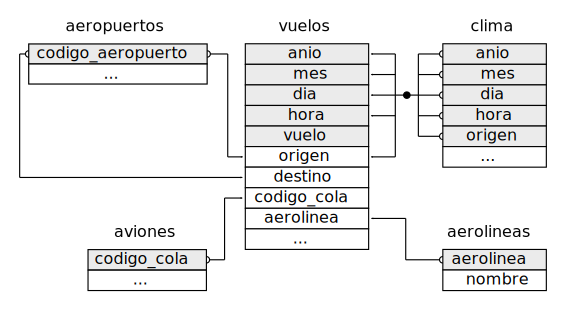
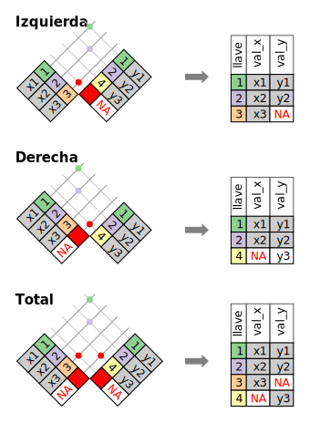
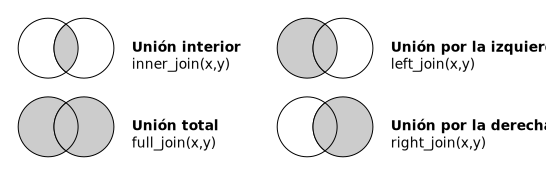

```{r setup, include=FALSE}

knitr::opts_chunk$set(warning = FALSE, message = FALSE, 
                      fig.width = 10.5, fig.height = 4, 
                      comment = NA, rows.print = 16)
options(htmltools.dir.version = FALSE)
options(servr.daemon = TRUE)
xaringan:::list_css()
```

# ¿Qué vamos a aprender?

1. Tipos de claves: primaria, foránea y subrogada
1. ¿Qué es una relación? 
1. Uniones de transformación
1. Uniones de filtrado
1. Operaciones con conjuntos
---

class: inverse, center, top
background-image: url("largada.jpg")
background-size:cover
# ¡Empecemos!


.footnote[Image credit: [Unplash](https://unsplash.com/)].

---
class: inverse, center, middle

## Motivación: 
#### En la vida real es raro que un análisis de datos involucre una única tabla de datos, por el contrario necesitaremos trabajar con más de un dataset, por lo que será de suma utilidad aprender a unir dos o más tablas. Para esto, aprenderemos los conjuntos de verbos que facilitan las **uniones** o  **JOINS**.

---
class: inverse, center, top
color-text:black
background-image: url("vuelos.jpg")
background-size:cover
# Dataset

#### Usaremos los datos sobre vuelos desde y hacia la ciudad de Nueva York, incluidos en el paquete **datos**, para aprender sobre datos relacionales. El paquete **datos** contiene cuatro tablas que se relacionan con la tabla `vuelos`:

```{r echo=FALSE, message=FALSE, warning=FALSE, tidy=FALSE}
library(tidyverse)
library(datos)
library(nycflights13)
library(here)
library(dplyr)
library(DT)
library(icon)
```

---
class: inverse, center, top
background-image: url("aeropuertos.jpg")
background-size:cover
# Aeropuertos

### Contiene información de cada aeropuerto, identificado por su código.

---
# aeropuertos

```{r aeropuerto, echo=FALSE}
knitr::kable(head(aeropuertos), format = 'html')

```

---
class: inverse, center, bottom
background-image: url("aerolineas.jpg")
background-size:cover
# Aerolíneas

### Permite observar el nombre completo de la aerolínea a partir de su código abreviado.

---
# aerolineas

```{r aerolineas, echo=FALSE, message=FALSE, warning=FALSE}
knitr::kable(head(aerolineas), format = 'html')
```

---
class: inverse, left, top
background-image: url("aviones.jpg")
background-size:cover
# Aviones

### Entrega información de cada avión, identificado por su codigo_cola.

---
# aviones

```{r aviones, echo=FALSE, message=FALSE, warning=FALSE}
knitr::kable(head(aviones), format = 'html')
```

---
class: inverse, center, top
background-image: url("clima.jpg")
background-size:cover
# Clima

### Entrega información del clima en cada aeropuerto de Nueva York para cada hora.

---
# clima

```{r clima, echo=FALSE}
knitr::kable(head(clima), format = 'html')
```

---
# Relaciones

* Recordemos que, se le llaman **datos relacionales** a múltiples tablas de datos, ya que no solo importan los conjuntos de datos individuales, sino que también sus relaciones son importantes.


--
* Las **relaciones** siempre se definen sobre un par de tablas. Todas las otras relaciones se construyen sobre esta idea simple: las relaciones entre tres o más tablas son siempre una propiedad de las relaciones entre cada par. 

--
* Diagrama de relaciones entre las diferentes tablas del dataset **vuelos**:



---
# Claves

Las variables usadas para conectar cada par de variables se llaman **claves** (del inglés _key_). Una clave es una variable (o un conjunto de variables) que identifican de manera única una observación. En casos simples, una sola variable es suficiente para identificar una observación. Por ejemplo, cada avión está identificado de forma única por su `codigo_cola`. En otros casos, se pueden necesitar múltiples variables. Por ejemplo, para identificar una observación en `clima` se necesitan cinco variables:  `anio`, `mes`, `dia`, `hora` y `origen`.

---
Existen diferentes tipos de claves:

* Una **clave primaria** identifica únicamente una observación en su propia tabla.
  Por ejemplo, `aviones$codigo_cola` es una clave primaria, ya que identifica de
  manera única cada avión en la tabla `aviones`.

* Una **clave foránea** únicamente identifica una observación en otra tabla.
  Por ejemplo, `vuelos$codigo_cola` es una clave foránea, ya que aparece en la
  tabla `vuelos`, en la que une cada vuelo con un único avión.
  
* **Clave subrogada**, campo numérico cuyo único requisito es almacenar un valor numérico único para cada fila de la tabla, de forma totalmente independiente a los datos de negocio, que habitualmente no tiene significado por sí misma.

  
---
class: inverse, center, middle
background-image: url("soga1.jpg")
background-size:cover
# JOINS

---
#Joins


Para trabajar con datos relacionales necesitas verbos que funcionen con pares de tablas. Existen tres familias de verbos diseñadas para trabajar con datos relacionales:

1. **__Uniones de transformación__** (del inglés **_mutating joins_**), que agregan nuevas variables a un *data frame* a partir de las observaciones coincidentes en otra tabla.

1. **__Uniones de filtro__** (del inglés **_filtering joins_**), que filtran observaciones en un *data frame* con base en si coinciden o no con una observación de otra tabla.

1. **__Operaciones de conjuntos__** (del inglés _set operations_), que tratan las observaciones como elementos de un conjunto.


---
# Uniones de transformación 
La  **__unión de transformación__** o **_mutating join_** te permite combinar variables a partir de dos tablas. 

--
1. Primero busca coincidencias de observaciones de acuerdo a sus claves,

--
1. Luego copia las variables de una tabla en la otra.


.footnote[[*]
Mas información en https://dplyr.tidyverse.org/reference/join.html]

---
# Uniones de transformación

Las funciones de unión, Tal como `mutate()`, agregan variables hacia la derecha, por lo que si tienes muchas variables inicialmente, las nuevas variables no se imprimirán.

Para lo tanto, crearemos un conjunto de datos más angosto para que sea más fácil ver qué es lo que está ocurriendo: 
```{r vuelos2, echo=TRUE}
vuelos2 <- vuelos %>%
  select(anio:dia, hora, origen, destino, codigo_cola, aerolinea)
vuelos2
```
---
#  Unión por izquierda ó Left Join 
Imagina que quieres incluir el nombre completo de la aerolínea en `vuelos2`. Puedes combinar los datos de `aerolinas` y `vuelos2` con `left_join()` (*union_izquierda*):

```{r vuelos_aerolinea, echo=TRUE, message=FALSE, warning=FALSE, paged.print=TRUE}
vuelos2 %>%
  select(-origen, -destino) %>%
  left_join(aerolineas, by = "aerolinea") #<<
```

---
#  Unión por izquierda ó Left Join 

El resultado de unir `aerolineas` y `vuelos2` es la inclusión de una variable adicional: `nombre`. Esta es la razón de que llamemos unión de transformación a este tipo de unión.

```{r union_vuelos_aerolinea, echo=FALSE, message=FALSE, warning=FALSE, paged.print=TRUE}
vuelos2 %>%
  select(-origen, -destino) %>%
  left_join(aerolineas, by = "aerolinea") #<<
```


---
#  Unión por derecha ó Right Join 

---
# Entendiendo las uniones

```{r echo=FALSE}

```

Para ayudarte a entender las uniones, usaremos una representación gráfica:

<!--  -->

---

# Representando uniones con diagrama de Venn:
Otra forma de ilustrar diferentes tipos de uniones es mediante un diagrama de Venn:

```{r, echo = FALSE, out.width = NULL}

```

 * Puede ayudar a recordar qué uniones preservan las observaciones en qué tabla pero esto tiene una limitante importante: un diagrama de Venn no puede mostrar qué ocurre con las claves que no identifican de manera única una observación.
 
---

### Filtering Joins


```{r message=FALSE, warning=FALSE}
dplyr::band_members
```

```{r message=FALSE, warning=FALSE}
dplyr::band_instruments
```


---
## Mutating Joins

### Left Join

.pull-left[
```{r plot-last, fig.show = 'hide'}
band_members %>% left_join(band_instruments)
```
]

.pull-right[
```{r ref.label = 'plot-last', echo = FALSE}
```
]

```{r message=FALSE, warning=FALSE}
band_members %>% left_join(band_instruments)
```

### Right Join
```{r message=FALSE, warning=FALSE}
band_members %>% right_join(band_instruments)
```
---


### Full Join
```{r message=FALSE, warning=FALSE}
band_members %>% full_join(band_instruments)
```

### Inner Join
```{r message=FALSE, warning=FALSE}
band_members %>% full_join(band_instruments)
```

---


## Filtering Joins

### Semi Join
```{r message=FALSE, warning=FALSE}
band_members %>% semi_join(band_instruments)
```

### Anti Join 
```{r message=FALSE, warning=FALSE}
band_members %>% anti_join(band_instruments)
```


---
Fuente:
.footnote[[*]El libro [R4DS]() y las slides de [Robust tools](https://github.com/gnab/remark/issues/142) de DjNavarro  in the future.
---