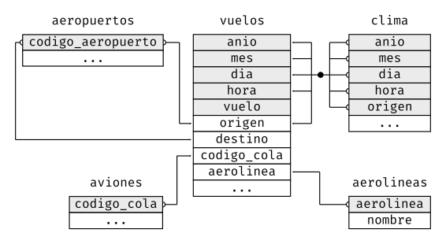
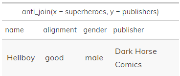

```{r setup, include=FALSE}

knitr::opts_chunk$set(warning = FALSE, message = FALSE, 
                      fig.width = 10.5, fig.height = 4, 
                      comment = NA, rows.print = 10)
options(htmltools.dir.version = FALSE)
options(servr.daemon = TRUE)
#xaringan:::list_css()
```

# ¿Qué vamos a aprender?

 1. Tipos de claves: primaria, foránea y subrogada
 
 1. ¿Qué es una relación? 
 
 1. Uniones de transformación
 
 1. Uniones de filtrado
 
 1. Operaciones con conjuntos
---

class: inverse, center, top
background-image: url("largada.jpg")
background-size:cover
# ¡Empecemos!


---
class: inverse, center, middle

## Motivación
#### En la vida real es raro que un análisis de datos involucre una única tabla de datos, por el contrario necesitaremos trabajar con más de un dataset, por lo que será de suma utilidad aprender a unir dos o más tablas. Para esto, aprenderemos los conjuntos de verbos que facilitan las **uniones** o  **JOINS**.

---
class: inverse, center, top
color-text:black
background-image: url("vuelos.jpg")
background-size:cover
## Dataset

#### Usaremos los datos sobre vuelos desde y hacia la ciudad de Nueva York, incluidos en el paquete **datos**, para aprender sobre datos relacionales. El paquete **datos** contiene cuatro tablas que se relacionan con la tabla `vuelos`:

```{r echo=FALSE, message=FALSE, warning=FALSE, tidy=FALSE}
library(tidyverse)
library(datos)
library(nycflights13)
library(here)
library(dplyr)
library(DT)
#library(aicon)
```

---
class: inverse, center, top
background-image: url("aeropuertos.jpg")
background-size:cover
## Aeropuertos

## Contiene información de cada aeropuerto, identificado por su código.

---
# aeropuertos

```{r aeropuerto, echo=FALSE}
#knitr::kable(head(aeropuertos), format = 'html')
glimpse(aeropuertos)
```

---
class: inverse, center, bottom
background-image: url("aerolineas.jpg")
background-size:cover
## Aerolíneas

## Permite observar el nombre completo de la aerolínea a partir de su código abreviado.

---
# aerolineas

```{r aerolineas, echo=FALSE, message=FALSE, warning=FALSE}
#knitr::kable(head(aerolineas), format = 'html')
#datatable(aerolineas)
glimpse(aerolineas)
```

---
class: inverse, left, top
background-image: url("aviones.jpg")
background-size:cover
# Aviones

### Entrega información de cada avión, identificado por su codigo_cola.

---
# aviones

```{r aviones, echo=FALSE, message=FALSE, warning=FALSE}
#knitr::kable(head(aviones), format = 'html')
#aviones
#datatable(aviones)
glimpse(aviones)
```

---
class: inverse, center, bottom
background-image: url("clima.jpg")
background-size:cover
# Clima

### Entrega información del clima en cada aeropuerto de Nueva York para cada hora.

---
# clima

```{r clima, echo=FALSE}
#knitr::kable(head(clima), format = 'html')
glimpse(clima)
```

---
# Relaciones

* Recordemos que, se llaman **datos relacionales** a múltiples tablas de datos, ya que no solo importan los conjuntos de datos individuales, sino que también sus relaciones son importantes.


--
* Una **clave primaria** y su correspondiente **clave foránea** en otra tabla forman una relación. 

--
* Las **relaciones** siempre se definen sobre un par de tablas. Todas las otras relaciones se construyen sobre esta idea simple: las relaciones entre tres o más tablas son siempre una propiedad de las relaciones entre cada par. 

---
# Relaciones

Diagrama de relaciones entre las diferentes tablas del dataset **vuelos**:
```{r diagrama_vuelos, echo=FALSE, out.width = '60%', fig.align="center"}


#
```

* `vuelos` se conecta con `aviones` a través de la variable  `codigo_cola`

* `vuelos` se conecta con `aerolineas` a través de la variable `codigo_carrier`.

* `vuelos` se conecta con `aeropuertos` de dos formas: a través de las variables `origen` y `destino`.

* `vuelos` se conecta con `clima` a través de las variables origen (es decir,la ubicación) más `anio`, `mes`, `dia` y `hora`.

---
# Claves

* Las variables usadas para conectar cada par de variables se llaman **claves** (del inglés _key_). 

* Una clave es una variable (o un conjunto de variables) que identifican de manera única una observación.

* En casos simples, una sola variable es suficiente para identificar una observación. 
**Ejemplo**: cada avión está identificado de forma única por su `codigo_cola`. 
* En otros casos, se pueden necesitar múltiples variables. 
**Ejemplo**, para identificar una observación en `clima` se necesitan cinco variables:  `anio`, `mes`, `dia`, `hora` y `origen`.

---
# Claves

Existen diferentes tipos de claves:

* Una **clave primaria** identifica únicamente una observación en su propia tabla.
  Por ejemplo, `codigo_cola` es una clave primaria, ya que identifica de manera única cada avión en la tabla `aviones`.

* Una **clave foránea** identifica de manera única una observación en otra tabla.
  Por ejemplo, `vuelos$codigo_cola` es una clave foránea, ya que aparece en la tabla `vuelos`, y une cada vuelo con un único avión.
  
* Una **clave subrogada**, es aquella que tiene como único requisito almacenar un valor numérico único para cada fila de la tabla, el cual es totalmente independiente a los datos de negocio.

**Importante:** Una variable puede ser clave primaria y clave foránea a la vez. Por ejemplo, `origen` es parte de la clave primaria de la tabla `clima` y también una clave foránea de la tabla  `aeropuertos`, es decir, permite que el `clima` se relacione con un determinado aeropuerto.


  
---
class: inverse, center, middle
background-image: url("soga1.jpg")
background-size:cover
# JOINS

---
#Joins

#### Una unión es una forma de conectar cada fila en x con cero, una o más filas en y. 


 Familias de verbos para trabajar entre pares de tablas:

1. **__Uniones de transformación__** (del inglés **_mutating joins_**), las cuales agregan nuevas variables a un *data frame* a partir de las observaciones coincidentes en otra tabla.

1. **__Uniones de filtro__** (del inglés **_filtering joins_**), las cuales filtran observaciones en un *data frame* con base en si coinciden o no con una observación de otra tabla.

1. **__Operaciones de conjuntos__** (del inglés **_set operations_**), las cuales tratan las observaciones como elementos de un conjunto.
---
#Joins
#### Sintaxis:

`tabla1` %>% **TIPO_DE_UNION** %>% `tabla2` **by** = "key"

Opciones de *TIPO_DE_UNION*:
* inner_join

* left_join

* right_join

* full_join

* anti_join

* semi_join

**by** (según) le indica a dplyr qué variable es la clave con la que se realizará la unión.

---
# Uniones de transformación 

La  **__unión de transformación__** o **_mutating join_** permite combinar variables a partir de dos tablas. 

--
#### 1. Busca coincidencias de observaciones entre ambas tablas de acuerdo a su/s clave/s

--
#### 2. Luego, copia las variables de una tabla a la otra.


#### Tipos:

.pull-left[
#### **unión interior** 
-----------------------------
mantiene las observaciones que aparecen en ambas tablas.
]

.pull-right[
#### **unión exterior** 
-----------------------------
mantiene las observaciones que aparecen en al menos una de las tablas
]

.footnote[Mas información en: https://dplyr.tidyverse.org/reference/join.html]

---
# Uniones de transformación

Las funciones de unión, tal como `mutate()`, agregan variables hacia la derecha, por lo que si tienes muchas variables inicialmente, las nuevas variables no se imprimirán.

Por lo tanto, crearemos un conjunto de datos más angosto para que sea más fácil ver qué es lo que está ocurriendo: 
```{r vuelos2, echo=TRUE}
vuelos2 <- vuelos  %>%
  select (anio:dia, hora, origen, destino, codigo_cola, aerolinea) %>% head(7)
vuelos2
```

---

# Entendiendo las uniones de transformación


Una **unión exterior** mantiene las observaciones que aparecen en al menos una de las tablas. Existen tres tipos de uniones exteriores:

* Una **unión izquierda (left join)** mantiene todas las observaciones en x.

* Una **unión derecha (right join)** mantiene todas las observaciones en y.

* Una **unión completa (full join)** mantiene todas las observaciones en x e y.


---
# Representación gráfica de las uniones exteriores

```{r echo=FALSE, out.width = '45%', fig.align="center"}
knitr::include_graphics("join-outer.svg")
```

---

#  Unión por izquierda 

Queremos incluir el nombre completo de la aerolínea en la tabla `vuelos2`.

####¿Cómo lo hacemos? 
--


Combinamos los datos de `vuelos2` y `aerolineas` 
--

con un `left_join()` (*union_izquierda*):


```{r vuelos_aerolinea, echo=TRUE, message=FALSE, warning=FALSE, paged.print=TRUE}

union_tablas <-  vuelos2  %>%
     left_join (aerolineas, by = "aerolinea")#<<


  
```

---
#  Unión por izquierda 

El resultado de unir `vuelos2` y `aerolineas` es la inclusión de una variable adicional, `nombre` en la primera tabla. Por esta razón llamamos unión de transformación a este tipo de unión.


```{r union_vuelos_aerolinea, echo=FALSE, message=FALSE, warning=FALSE, paged.print=TRUE}
union_tablas %>% head(10) #<<
  
```
---
class: inverse, center, top
background-image: url("banda1.jpg")
background-size:cover
# Dataset bandas 
---
# Tablas
.pull-left[
```{r message=FALSE, warning=FALSE}
dplyr::band_members
```
]

.pull-right[
```{r message=FALSE, warning=FALSE}
dplyr::band_instruments
```
]


```{r tabla_banda_instrumento, echo=FALSE, out.width = '100%', fig.align="right"}

knitr::include_graphics("tablas_banda_instrumento.png")
```


---
# Unión interna o Inner Join


```{r banda_inner, echo=TRUE, message=FALSE, warning=FALSE}
band_members %>% inner_join(band_instruments)#<<
```

```{r inner_join_banda, echo=FALSE, out.width = '100%', fig.align="center"}
knitr::include_graphics("inner_join_banda_instrumento.png")
```


**Importante:** La propiedad más importante de una unión interior es que las filas no coincidentes no se incluyen en el resultado. 

---


# Unión izquierda
```{r banda_left, echo=TRUE, warning=FALSE, message=FALSE}
band_members %>% left_join(band_instruments)#<<
```

```{r left_join_banda, echo=FALSE, out.width = '100%', fig.align="right"}
knitr::include_graphics("left_join_banda_instrumento.png")
```

---


# Unión derecha 
```{r banda_right, echo=TRUE, warning=FALSE, message=FALSE}
band_members %>% right_join(band_instruments)#<<

```

```{r right_join_banda, echo=FALSE, out.width = '100%', fig.align="right"}
knitr::include_graphics("right_join_banda_instrumento.png")
```


---
# Full Join
```{r banda_full, echo=TRUE, message=FALSE, warning=FALSE}
band_members %>% full_join(band_instruments)#<<
```


```{r full_join_banda, echo=FALSE, out.width = '100%', fig.align="center"}
knitr::include_graphics("full_join_banda_instrumento.png")
```

---

# Diagramas de Venn:

Otra forma de ilustrar diferentes tipos de uniones es mediante un diagrama de Venn:

```{r, echo = FALSE, out.width = '100%', fig.align="center"}
knitr::include_graphics("join-venn.svg")

```

 * Son útiles para recordar qué uniones preservan las observaciones en qué tabla 
 
 
 * Tienen una limitante importante: un diagrama de Venn no puede mostrar qué ocurre con las claves que no identifican de manera única una observación.
 
---

# Uniones de filtrado 

Las **__Uniones de filtrado__** unen observaciones de la misma forma que las uniones de transformación pero afectan a las observaciones, no a las variables.Además, uniones de filtro no duplican filas como lo hacen las uniones de transformación.

####Tipos:

*  **semi_join:** mantiene todas las observaciones en x con coincidencias en y. Las semi uniones son útiles para unir tablas resumen previamente filtradas con las filas originales.

*  **anti_join:** descarta todas las observaciones en x con coincidencias en y.
  
---
# Uniones de filtrado

### Semi Join
```{r banda_semi, echo=TRUE, message=FALSE, warning=FALSE}
band_members %>% semi_join(band_instruments) #<<
```

```{r semi_join_banda, echo=FALSE, out.width = '100%', fig.align="center"}
knitr::include_graphics("semi_join_banda_instrumento.png")
```
---
# Uniones de filtrado

### Anti Join 
```{r banda_anti, echo=TRUE, message=FALSE, warning=FALSE}
band_members %>% anti_join(band_instruments) #<<
```

```{r anti_join_banda, echo=FALSE, out.width = '100%', fig.align="center"}
knitr::include_graphics("anti_join_banda_instrumento.png")
```

---
# Utilidad de las uniones de filtrado
* Las **semi uniones** son útiles para unir tablas resumen previamente filtradas con las filas originales.

```{r destinos_populare, message=FALSE, warning=FALSE, include=FALSE}
destinos_populares <- vuelos %>%
  count(destino, sort = TRUE) %>%
  head(7)

```

Buscamos cada vuelo que fue a alguno de los destinos más populares: 

```{r semi_join_vuelos, echo=TRUE, message=FALSE, warning=FALSE}
vuelos %>%
  semi_join(destinos_populares)%>% #<<
  head(5)
```
---
# Utilidad de las uniones de filtrado

* Las **anti uniones** son útiles para encontrar desajustes. Por ejemplo, al conectar `aviones` y `vuelos`, podría ser interesante saber que existen muchos `vuelos` que no tienen coincidencias en `aviones`:

```{r vuelos_sin_aviones, echo=TRUE, message=FALSE, warning=FALSE}
vuelos %>%
  anti_join(aviones, by = "codigo_cola") %>%  #<<
  count(codigo_cola, sort = TRUE)%>% head(7)
```

---

# Operaciones de conjuntos

Tratan las observaciones como elementos de un conjunto.

* `intersect(x, y)`: devuelve las observaciones comunes en x e y.

* `union(x, y)`: devuelve las observaciones únicas en x e y.

* `setdiff(x, y)`: devuelve las observaciones en x pero no en y.

**Ejemplo:**

```{r tribble, echo=TRUE, message=FALSE, warning=FALSE}
df1 <- tribble(
  ~x, ~y,
  1, 1,
  2, 1
)
df2 <- tribble(
  ~x, ~y,
  1, 1,
  1, 2
)
```
---

# Operaciones de conjuntos


Las cuatro posibilidades son:

```{r operaciones_conjuntos, echo=TRUE, message=FALSE, warning=FALSE}
intersect(df1, df2)
union(df1, df2)
```
---

# Operaciones de conjuntos

```{r operaciones_conjuntos2, echo=TRUE, message=FALSE, warning=FALSE}

setdiff(df1, df2)
setdiff(df2, df1)
```
---

class: inverse, center, middle
background-image: url("marvel.jpg")
background-size:cover
## Otros Ejemplos
### Dataset editoriales y superhéroes
---
# data frames
```{r superheroes, echo=TRUE, message=FALSE, warning=FALSE}

superheroes <- tibble::tribble(
       ~name, ~alignment,  ~gender,          ~publisher,
   "Magneto",      "bad",   "male",            "Marvel",
     "Storm",     "good", "female",            "Marvel",
  "Mystique",      "bad", "female",            "Marvel",
    "Batman",     "good",   "male",                "DC",
     "Joker",      "bad",   "male",                "DC",
  "Catwoman",      "bad", "female",                "DC",
   "Hellboy",     "good",   "male", "Dark Horse Comics"
  )

publishers <- tibble::tribble(
  ~publisher, ~yr_founded,
        "DC",       1934L,
    "Marvel",       1939L,
     "Image",       1992L
  )
```
---
## inner_join(superheroes, publishers)
.pull-left[
```{r superheroes_inner, echo=TRUE, message=FALSE, warning=FALSE}
superheroes %>% inner_join (publishers)
```
]
.pull-right[
```{r superheroes_inner2, echo=FALSE, out.width = '90%', fig.align="right"}
knitr::include_graphics("inner_superheroe.png")
```
]
---
## full_join(superheroes, publishers)
.pull-left[
```{r superheroes_full, echo=TRUE, message=FALSE, warning=FALSE}
superheroes %>% full_join (publishers)
```
]
.pull-right[
```{r superheroes_full2, echo=FALSE, out.width = '70%', fig.align="right"}
knitr::include_graphics("full_superheroe.png")
```
]
---
## left_join(superheroes, publishers)
.pull-left[
```{r superheroes_left, echo=TRUE, message=FALSE, warning=FALSE}
superheroes %>% left_join (publishers)
```
]

.pull-right[
```{r superheroes_left2, echo=FALSE, out.width = '75%', fig.align="right"}
knitr::include_graphics("left_superheroe.png")
```
]
---
## anti_join(superheroes, publishers)

```{r superheroes_anti, echo=TRUE, message=FALSE, warning=FALSE}
superheroes %>% anti_join (publishers)
```


```{r superheroes_anti2, echo=FALSE, out.width = '75%', fig.align="center"}

```


---

## Fuentes:

* [R para Ciencia de datos](http://r4ds.had.co.nz/) 

* [Primers de Rstudio](https://rstudio.cloud/learn/primers/4.3)

* Slides de [Robust tools](https://github.com/gnab/remark/issues/142) de DjNavarro.

* [Chapter 15 Join two tables](https://stat545.com/join-cheatsheet.html) de Jenny Bryan

-------------------------------------------------

Slides creadas con el paquete de R [**xaringan**](https://github.com/yihui/xaringan), utilizando el Css [summer_light](https://github.com/PatriLoto/datos_relaciones_con_dplyr/blob/master/summer_light.css).

Las imágenes fueron tomadas de   [Unplash](https://unplash.com).
---